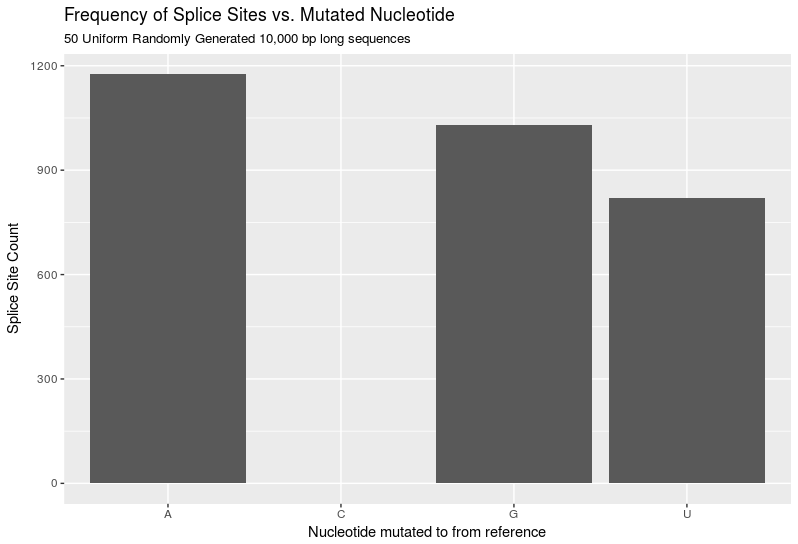
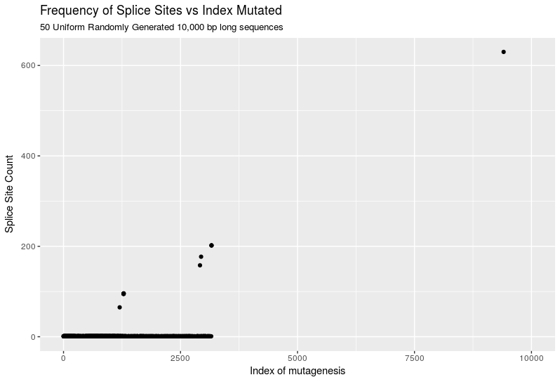

# NovaSplice
#### Arya Kaul

#### 2018-06-15
Google drive folder has been created with relevant papers. [Link is here](https://drive.google.com/drive/folders/14_M6-YHQTlVhZLqZwtEI6FyJ9Phcl88U?usp=sharing).

In aggregate, they suggest that the best way to identify intronic regions that could present themselves as novel splicing regions is to identify those regions that contain the closest relationship to donor/acceptor splice sites and then artificially mutate them. For every mutation event, we could measure the likelihood of it being a splice site using existing methods and assign a probability of this mutation causing a novel splicing event. Unfortunately, this method would be computationally burdensome and its complexity would increase if we wanted to consider >1 mutagenesis events.

That being said, is there a more elegant way to do this? I don't (currently) see one.

Let's try to implement the naive solution first. This code is found in scripts/main.py.

Goal?
Given an arbitrary FASTA file, let's assign possible mutation events to each nucleotide and its associated potential for causing a splicing event. 

To this end, I have written a function to parse and read into memory an arbitrary FASTA file. 
I then wrote a function that given a dna sequence, generates every possible *single* nucleotide mutagenesis event and outputs a list of them. For every generated nucleotide mutagenesis event, we associate the location of mutagenesis and the REF->ALT nucleotide change.

Now, I need to build a function that can take a nucleotide sequence, and an associated index. And assign a score (likelihood function) to that nucleotide index to the probability of that index being involved in a splicing event.

**UPDATE** - I think it would be more simple to split the initial function into 3 separate scores. One score for the mutation leading to a donor splice site, one score for the mutation leading to a branch point adenine, and one score for the mutation leading to a acceptor splice site.

#### 2018-06-18
I've successfully completed the `donorScore` function, and cleaned up some logic in the beginning. I've also added more thorough commenting throughout.

#### 2018-06-19
Completed the acceptorScore function - I think it's working well -- but I'm not sure how efficient my approach is. It seems like there should be a good way to combine each of these functions together; however, it still eludes me. Potentially after I complete the branchScore function, I will be better able to think of a good approach for this.

Completed the branchScore function. Now I have to think of a good way to output his data. Currently the information I compute is binary. ie.e given a dna-sequence and an index (location of SNP) within that dna-sequence, I can tell you if the mutation creates a donor splice site, a branch point, or a acceptor splice site.

Given that, what's the best way to output that information? I could create a dictionary of sorts that tracks for every index (location of SNP) how many times does a mutation result in the introduction of a splice site?? That could be interesting, I could determine if novel intronic splice 'hotspots' exist by seeing if that distribution changes substantially between locations. I can't think of a good reason why it could, but eh who knows? I could also try and output the spliced exons I predict using the information I got? That might be good for clinical stuff.

Since the first idea is easier to implement I think I'll start with that approach. So in an ideal scenario, this is the format of the file I would like to output:

|LOCATION|A|C|G|T|
|--------|-|-|-|-|
|0       |2|2|3|R|

An 'R' would denote the fact that this is the reference at this location. The numbers would correspond to the # of all possible splice sites generated at that position and with that nucleotide substitution. Note that multiple splice sites are possible at a given location and nucleotide since the distance between the donor splice site and the branch point is arbitrary (per my understanding of the lit?? Plus when I make this probabilistic, it would make more sense)

#### 2018-06-21
Yesterday I wrote a function `randomSeqs.py` that can generate a fasta file containing a set of random DNA sequences at a specified length. I also wrote and tested the function to output the first output file described above. I attempted to run my code on a fasta file with RNA sequence length of 100,000; but that crashed. Currently, I am working on optimizing my code, and will try again.

In the meantime, I'll run my code NovaSplice on 50 RNA sequences of length 10,000. 

**UPDATE** I was able to successfully run NovaSplice on the 10,000 length data, and I've rewritten the code to hopefully be more memory efficient. I'll start running the 100,000 length data before I leave and consider ways to visualize and analyze the resulting summary stats from the 10,000 length data.

Based on cursory exploration it appears that most positions have no splice sites, regardless of the mutation. There are a number of very strong position/mutation combos that appear to exhibit an extremely high number of splice sites. 

Max. splice sites found in 10,000 length data is 3,027 splice sites as determined by `grep` and `wc`.

#### 2018-06-22
100,000 long RNA sequences are still being processed; however, I visualized the 10,000 RNA sequences a bit more. I generated two plots reproduced here:

**What do these mean??** Not really sure, but let's take a stab. Let's analyze the mutated nucleotide vs Splice Site frequency figure first.

The figure shows a clear spike in Adenine/Guanine creating a Splice site vs Cytosine or Uracil. This makes sense! A typical splice site has the following form:

XXXXXGU----A----AGXXXXXX

Where the 'X' refers to exons. As you can see, Cytosine is not present at all (hence why it's count is zero. good!). Additionally Uracil appears only once, while Adenine and Guanine appear twice as much. This is good! There is an interesting consideration that is not being taken into account though: the poly-pyrimidine tail. The poly-pyrimidine tail appears to the right of the branch point and typically consists of 15-20 pyrimidines (but mostly Uracil). Let's say that previously the region contained 14 uracils, and one Guanine. A mutation changing that Guanine to a Uracil could cause a splice site to develop in that region. Currently, NovaSplice doesn't take that into account; however, it should be something considered and I'll add it to future work. All in all, this figure is what's to be expected and I think makes sense in the context of what I know so far.

The second figure is where things get dicey. Theoretically, given an infinitely long string of random RNA any location (should be?) equally likely of forming a novel splice site. In that case, why do we observe so many splice site in the beginning with a frequency of one? Why don't we see any later on? Additionally, why does one location have the propensity to generate so many splice sites? Currently, I'm not sure why this is the case, but it does warrant further investigation. ALL IN ALL I THINK THIS IS GOING VERY WELL.

#### 2018-06-25
The 100,000 run crashed before finishing. This was to be expected, as it was studying 50*3100,000 possible mutation events for splice sites. The README is beautiful, and I've refined the test cases and outputs. 

